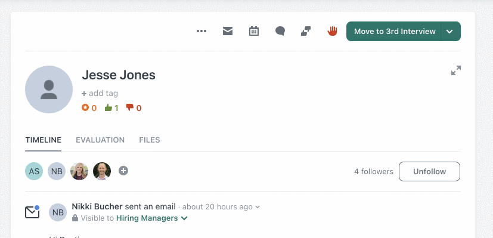

# Technical Exercises

Sparkbox uses take home, [technical exercises] to help guage [fluency][sparkbox-values]. We know this is incredibly difficult to do efficiently without putting an undo burden on applicants and it is also difficult to do without some level of bias.

The parameters of our technical exercises include:

* Exercises should provide no meaningful business value to Sparkbox outside of helping to assess fluency.
* Exercises should be able to be completed in approximately 4 hours for most developers, but we clearly ask applicants to take no more than 8 hours maximum. This is well beyond a reasonable amount of time to ask.
* Exercises can be completed on the applicants own schedule; there is no expiration.
* Criteria on which exercises will be reviewed should be clear and included with the exercise.
* Incomplete submissions are accepted and a pairing session can be scheduled regardless of completion to provide guidance for applicants. 


## Completing a blind review

Blind reviews are important, because they allow us to assess a candidate's technical exercise submissions with less bias than might otherwise occur.

Blind reviews are posted in a private channel, #tech-exercises, with:
1. The exercise we requested the candidate complete
2. A link for providing feedback in Workable.com 
3. The candidate's submission, primarly as a private, anonymized Sparkbox Github repository. 

_Note: The submission is anonymized as much as reasonably possible, but it is not foolproof._

To complete a blind review:

1. Clone the repository locally.
2. Follow the evaluation criteria in the exercise.
3. Post to Workable the quantitative evaluation score, including a list of checks that passed or failed, along with qualitative feedback you have on the submission.

## Preparing Blind Reviews
 To do this, we:

### 1. *Anonymize the submission*

Clone the submitted repository to an anonymous folder based on the Workable entry ID. This ID can be found by navigating to the candidate and finding the ID in the URL: `https://sparkbox.workable.com/backend/jobs/:job-id:/browser/2nd-interview/candidate/:candidate-id:`

```
clone <repo> sparkbox-tech-exercise-:candidate-id:
```

You now have the repository locally, but it still has the candidate's identifying information in the commit history. To remove it, we'll use [`git-anonymize`](https://github.com/cvortmann/git-anonymize).

```
cd sparkbox-tech-exercise-:candidate-id:
git anonymize
```

[Create a private repo](https://github.com/new) in the Sparkbox organization for the anonymized repo. Push the repo to that remote:

```
git remote add sparkbox git@github.com:sparkbox/sparkbox-tech-exercise-:candidate-id:.git
git push sparkbox main
```

### 2. Create an feedback link in Workable

Feedback will be posted in Workable, our interviewing and hiring tool. For team and blind review feedback, we create a link that does not provide history of the candidates other interactions. It _will_ show their name, which is ok, but not great.

To create this link, head to workable, navigate to the candidate, and use the "Share" menu. Use the "By Link" option and disable "Show timeline and evaluation".



### 2. Share the repo with Anonymous reviewers 

Anonymous reviewers are in the #tech-exercises private channel. In this channel post a message like the following:

> :tada: A blind review is needed for a candidate. Please have feedback posted within 48 hours. Thanks!
>
> * Exercise: [Exercise Name with a deep link][technical exercises]
> * Feedback Link: Link to Workable created in step 2
> * Repository: https://github.com/sparkbox/sparkbox-tech-exercise-:candidate-id:

[sparkbox-values]: https://github.com/sparkbox/standard/blob/bf409dd264db924c92909f2d477dc8b49d15539b/culture/our-foundation/README.md#our-foundation
[technical exercises]: https://docs.google.com/document/u/1/d/1LcAP0ID9R3hsL90LW-Mldk2PxHQVA1EijTeX7qYU2K4/edit
